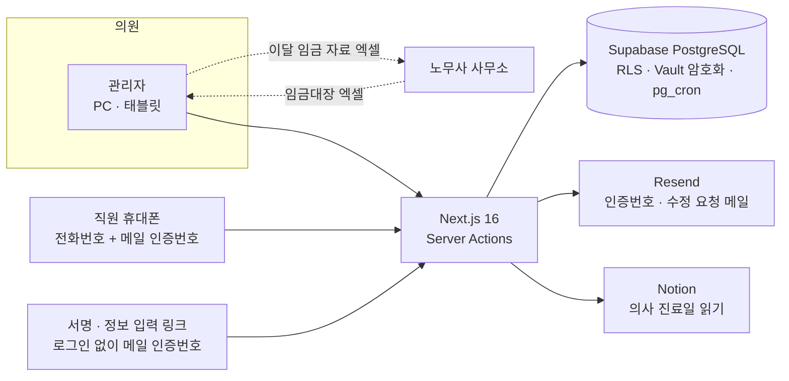
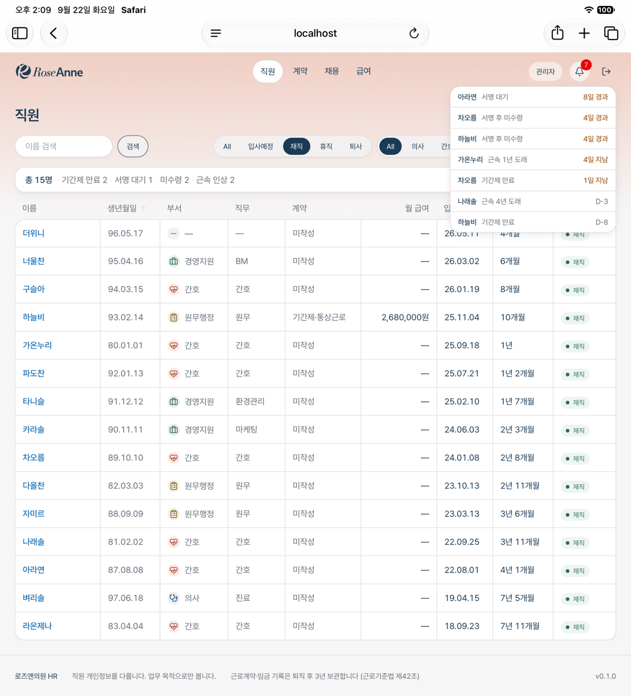
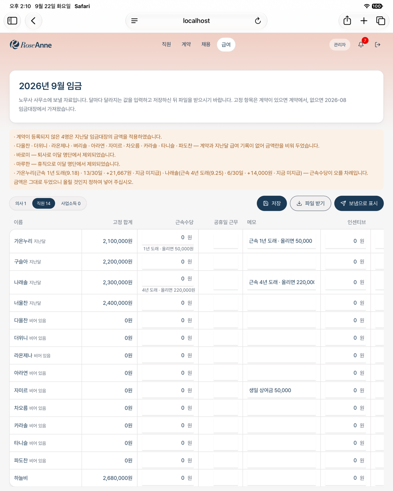
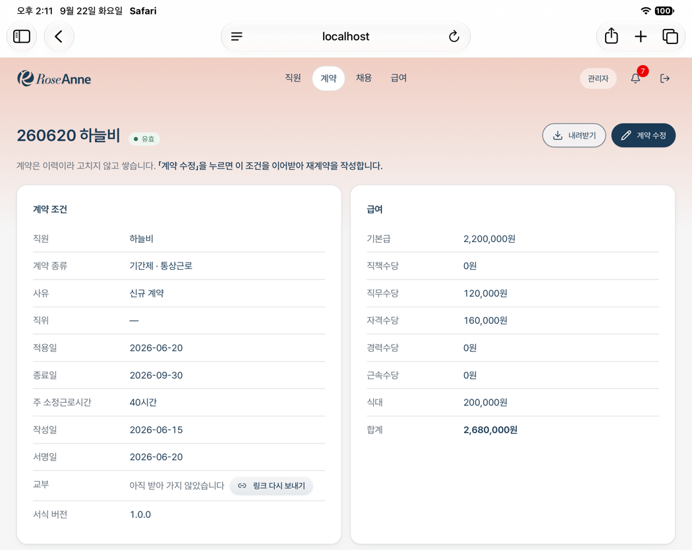
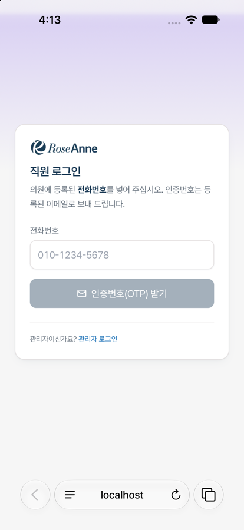
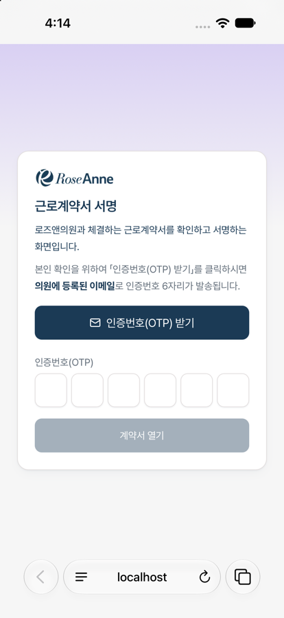
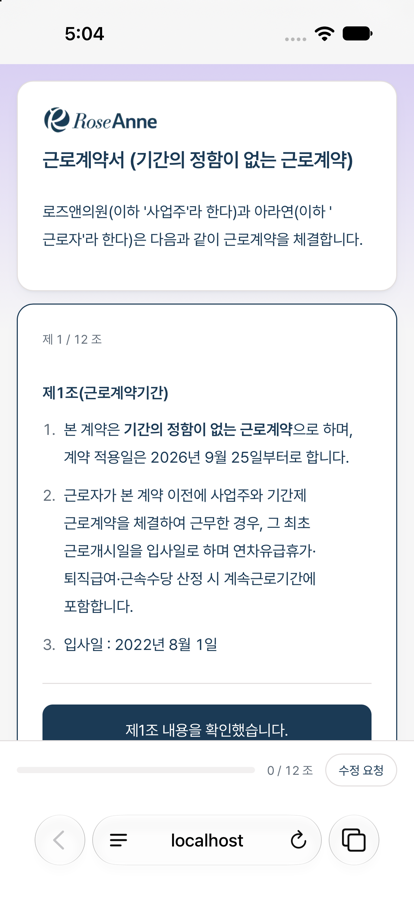

<p>
  <picture>
    <source media="(prefers-color-scheme: dark)" srcset="screens/logo-white.png">
    
  </picture>
</p>

# 로즈앤 HR

> **의원 하나의 노무·급여를 「틀리지 않게」 옮긴 내부 도구**
> 노션 문서와 엑셀로 하던 근로계약 · 수당 · 급여 자료를 시스템으로 옮겼습니다. 2026년 9월 17일부터 실제 직원의 명부 · 계약 · 급여 자료가 이 프로그램에 있습니다 — 예전 종이 계약은 옮겨 담았고, 새 계약은 전자로 서명받습니다.

| | |
|---|---|
| 기&#8288;간 | 2026.09.06 ~ 운영 중 · 개인 프로젝트 |
| 쓰&#8288;는&nbsp;곳 | 로즈앤의원(산부인과) — 관리자 1명 · 직원 15명 · 부원장 3명 |
| 내&nbsp;역&#8288;할 | **혼자** — 노무 규칙 정리 · 기획 · 화면 설계 · 개발 · 배포 · 운영. 코드는 Claude Code 와 짝을 이뤄 썼습니다(6절). 의원의 로고 · 홈페이지 · 브랜딩도 직접 만들었습니다 |
| 코&#8288;드 | 비공개 — 실제 직원의 개인정보와 급여를 다루는 운영 중인 서비스라, 이 저장소에는 설명과 화면만 둡니다 |

### 한눈에

| 커밋 | 자동 검사 | DB 마이그레이션 | 규칙 · 설계 문서 |
|---|---|---|---|
| **382개** | **817건** 단위 + **23건** 통합 | **119개** | **12종 · 8,434줄** |

<sub>2026-09-22 기준. 화면 25개 · TypeScript 약 2.5만 줄 · 검사 코드 약 1만 줄. 통합 검사는 로컬 DB 에 채용부터 퇴사까지 전 과정을 돌립니다.</sub>

---

## 1. 왜 만들었나

산부인과 의원 하나가 노무 · 급여를 **노션 문서와 엑셀 파일**로 관리하고 있었습니다. 계약서는 노션에 손으로 써서 출력해 서명받고 스캔해 두었고, 수당은 표를 보며 손으로 옮겨 적었고, 급여는 노무사 사무소와 엑셀을 주고받았습니다.

여기서 틀리면 **금액이나 법적 의무가 달라집니다.**

- 근속수당이 오르는 날을 놓치면 **임금 체불**입니다
- 계약서를 건넨 기록이 없으면 근로기준법 **제17조**(근로조건 명시 · 교부)를 지켰다고 입증할 수 없습니다
- 임금명세서를 건넨 기록이 없으면 **제48조②**(임금명세서 교부)를 지켰다고 입증할 수 없습니다

그래서 이 도구의 목표는 「편리」가 아니라 「**틀리지 않기**」입니다. 그리고 스무 명이 안 되는 의원이므로 **대기업 기준으로 만들지 않습니다** — 자주 하는 일은 2클릭 안에, 주요 작업은 1~2화면에서 끝나게.

## 2. 무엇을 만들었나



**채용 → 직원 등록 → 개인정보 입력 → 계약 작성 · 검증 → 비대면 서명 · 교부 → 이달 임금 자료 → 노무사 사무소 → 임금대장 올리기 → 임금명세서 · 이체 파일 → 퇴사 예약 · 보관 기한**

| 영&#8288;역 | 하는 일 |
|---|---|
| 직&#8288;원 | 목록 · 상세 · 등록, **알림**(기간제 만료 · 서명 대기 · 미수령 · 근속 응당일 · 최저임금 미달 · 보관 기한), 퇴사 예약(퇴사일 00:05 에 바뀐다), 사용증명서(제39조) |
| 채&#8288;용 | 지원자 진행판 — 사람마다 다음에 할 일을 보여 준다, 이력서 보관, 입사로 넘기기 |
| 계&#8288;약 | 서식으로 계약서 작성 → **검증 V1~V10**(최저임금 미달 · 기간제 누적 2년 등) → 비대면 서명 → 교부 기록 → PDF. 예전 종이 계약도 옮겨 담는다 |
| 급&#8288;여 | 이달 임금 자료(엑셀) 만들기 → 노무사 사무소 → 임금대장 올리기 → **임금명세서 · 은행 이체 파일**. 상여금(분기 · 명절 · 생일)은 기준표에서 |
| 기&#8288;준&#8288;표 | 수당 다섯 가지 · 최저임금 · 상여금을 **시점별 행**으로 둔다. 직위 · 등급도 여기서 늘린다 |
| 직&#8288;원&nbsp;화&#8288;면 | 휴대폰 한 장 — 기본정보 · 계약 · 급여 · 서류. 연락처와 계좌는 본인이 고친다 |

### 화면

<sub>로컬 DB 에 합성 데이터를 넣고 촬영했습니다. 화면의 직원 이름 · 생년월일 · 계약 · 금액은 모두 가상입니다. 의원 이름과 로고는 실제입니다.</sub>

**관리자 — 직원 목록과 알림.** 기간제 만료 · 서명 대기 · 미수령 · 근속 인상을 표 위 한 줄로 세우고, 종을 누르면 급한 순으로 펼칩니다. 0인 항목은 빼서 「지금 챙길 것」만 남깁니다.

<p></p>

**관리자 — 이달 임금 자료.** 노무사 사무소에 보낼 엑셀을 원내에서 채웁니다. 고정 항목은 계약에서, 계약이 없으면 지난달 임금대장에서 가져오고, **둘 다 없으면 금액을 지어내지 않습니다** — 이름 옆에 「비어 있음」을 달고 표 위에 채워야 할 사람을 모아 말합니다. 근속수당이 오를 차례인 사람은 금액을 바꾸지 않고 짚기만 합니다. 급여를 셈하는 것은 노무사 사무소입니다.

<p></p>

**관리자 — 계약 상세.** 서명이 끝난 계약은 이력이라 고치지 않고 쌓습니다(「계약 수정」은 조건을 이어받아 재계약을 씁니다). 서명은 끝났는데 직원이 아직 받아 가지 않았으면 「링크 다시 보내기」 버튼이 나타납니다 — 교부는 **직원이 받아 간 것만** 셉니다.

<p></p>

**직원 — 휴대폰으로 하는 로그인과 비대면 서명.** 앱 설치 없이 전화번호와 메일 인증번호로 들어옵니다. 서명 링크는 관리자가 복사해 문자 · 카카오톡으로 보내고, 인증번호는 프로그램이 메일로 보냅니다. **두 길을 나눠 보내므로** 메일에 링크가 들어갈 수 있는 길(`<a>` · 이미지 · 웹폰트)을 모두 검사로 막았습니다. 계약서는 조마다 확인하고 넘어갑니다.

<table>
  <tr>
    <td></td>
    <td></td>
    <td></td>
  </tr>
  <tr>
    <td align="center">직원 로그인</td>
    <td align="center">서명 — 본인 확인</td>
    <td align="center">서명 — 조마다 확인</td>
  </tr>
</table>

### 핵심 설계 원칙 — 노무는 틀리면 법적 비용이다

| 틀리지 않게 | 새지 않게 |
|---|---|
| **규칙은 문서가 쥔다** — 코드와 다르면 문서가 옳다 | 주민등록번호 · 계좌번호는 **Vault 에 둔 키로 암호화**. 화면에는 기본으로 가린 값 — 원문은 관리자가 누를 때와 본인 화면에서만 |
| 명세서에 없는 판단은 **지어내지 않고 묻는다** | 권한은 화면이 아니라 **DB(RLS)가 막는다** |
| **계산 결과를 저장하지 않는다** — 원천만 두고 다시 센다 | 직원이 제 정보를 고치는 길은 **DB 함수 둘** — 연락처와 계좌를 다른 문으로 |
| 수당은 **기준표 조회**, 누적 계산 금지 · 금액을 코드에 박지 않는다 | 서명 링크와 인증번호는 **다른 길로** — 메일에 링크를 넣지 않는다 |
| 이력은 **행을 더해** 남긴다 — 과거 계약서를 그때 기준으로 재현 | 바깥에서 온 오류 문구를 **화면 · 기록에 그대로 올리지 않는다** |

```ts
// 옳음 — 기준표에서 적용일 시점에 유효한 행을 찾는다
const amount = lookupAllowance(rules, { kind: 'TENURE', keyYear: years, asOf })

// 틀림 — 증가폭이 구간마다 다르다. 누적으로 짜면 한 구간에서만 조용히 틀린다
const amount = base + years * step
```

### 하지 않기로 한 것

| | 이유 |
|---|---|
| 급여 계산(세금 · 4대보험 · 실지급액) | 노무사 사무소가 셈한 임금대장을 **담기만** 한다. 보낼 자료를 채우는 셈(월 중 입 · 퇴사 일할, 진료일 × 일급)은 제안값일 뿐이고, 명세서와 이체 파일은 대장 값으로만 낸다. 대장 합계가 안 맞으면 고쳐 담지 않고 문제로 알린다 |
| 휴일근로 · 가산수당 셈 | 통상시급의 끝자리 규칙(절상 · 절사)이 아직 미결이고, 나누는 시간이 사람마다 달라 한 산식에 들어가지 않는다. 틀리면 임금 체불이라 공휴일 근무 일수만 적어 노무사 사무소로 넘긴다 |
| 다단계 승인 · 정교한 감사 추적 | 스무 명이 안 되는 의원이다. 관리자 한 사람이 주 1~2회 쓰는 도구에 대기업의 절차를 습관처럼 넣지 않는다 |
| 화면 사진 회귀 검사 | 디자인을 일부러 자주 바꾸는 프로젝트라 기준 사진을 늘 다시 찍게 된다. 대신 **부품에 규칙을 가두고**(`<Button>` · `<Card>` · `<Field>`) 손으로 조립한 클래스를 검사가 막는다 |
| 부원장 급여를 월급제 틀에 넣기 | 일급제 계약이라 섞으면 구조가 오염된다. 요일별 일급을 따로 두고(× 진료일수) 기본급 · 수당 칸은 0으로 남긴다 |

---

## 3. 내가 한 일

### 3-1. 노무 규칙을 먼저 문서로

- 노션과 엑셀에 흩어져 있던 규칙을 **규칙 명세서**로 옮겼다 — 수당 다섯 가지, 계약의 두 축(계약기간 × 근로시간), 검증 V1~V10, 연차 세 트랙(월차 · 비례연차 · 연차)과 가산(연차 계산 구현은 Phase 3)
- 명세서에 없는 판단이 나오면 **만들다 멈추고 물었다.** 「병가는 결근인가?」, 「통상시급은 절상인가 절사인가?」는 아직 답을 기다린다 — 그래서 연차는 만들지 않았고, 휴일근로수당은 셈하지 않고 일수만 적는다
- 코드가 먼저 짐작한 적도 있다 — 분기 상여금을 분기 달이면 모두에게 넣고 있었다. 알아챈 뒤에는 **명세서를 먼저 고치고**(그 달 말일 재직 · 만 3개월 · 만 2개월 이상은 줄어든 금액) 코드가 따라갔다
- 문서 12종 — 규칙 명세서 · 스키마 · PRD 2벌 · 보안 기준 · 디자인 시스템과 그 **개정 이력** · 이관 명세 · 계약서 서식 · 검사 시나리오 · 배포 가이드 · 인수인계서. 버전을 붙이고(`0.0.x` 표현 / `0.x.0` 항목 추가 / `x.0.0` 규칙 변경) 머리말과 개정 이력이 맞는지 검사가 본다

### 3-2. 설계 · 개발

- `lib/domain/` 은 **순수 함수만** 둔다(42개 파일). DB 에 기대지 않아 구현한 노무 규칙을 단위 검사로 덮고, 규칙이 바뀌면 이 폴더만 고친다
- **전자계약** — 서식 변수 → 계약서 → 비대면 서명 → 교부 → PDF. 서식의 `{{변수}}` 가 화면 값에 다 있는지 검사가 센다
- **급여** — 임금대장 엑셀을 읽되 칸 이름이 바뀌면 0원으로 담지 않고 문제로 알린다. 은행 이체 파일은 은행 코드 28개 — **표에 없는 은행은 짐작하지 않는다**(돈이 엉뚱한 곳으로 간다)
- **개인정보** — 암호화 키 둘(계좌 · 주민번호), RLS, 본인이 고치는 문은 **직원 id 를 인자로 받지 않는다**(받는 순간 남의 것을 고치는 문이 된다). 퇴사하면 주민번호는 곧바로 지우고, 계좌는 한 달 뒤 파기를 알린다(지우는 것은 사람이)
- **디자인 시스템** — 브랜드 팔레트에서 토큰을 뽑고 부품으로 모았다. 375px 까지 반응형(휴대폰 세로에서만 표의 줄이 카드가 된다). 관리자는 살구, 직원이 보는 화면은 보라 — **바탕색이 「누구의 화면인가」를 말한다**

### 3-3. 배포 · 운영

- Vercel + Supabase, 회사 도메인. 운영 마이그레이션은 적용 전에 백업을 받고, 데이터를 바꾸는 마이그레이션은 **운영 대상을 먼저 센다** — 로컬에서 0건인 것만 보고 올렸다가 운영 관리자 계정이 꺼진 뒤에 생긴 규칙이다
- 합성 데이터로 만들고 **실제 직원으로 전환**(2026-09-17). 합성 데이터 스크립트는 운영에 실제 직원이 있으면 스스로 멈춘다
- 예약 작업(pg_cron) — 퇴사일 00:05 에 퇴사로 바꾼다. 보관 기한이 지난 개인정보(입사 취소자 30일 · 퇴사자 계좌 한 달)는 **알림으로만 알리고, 지우는 것은 사람이 한다** — 지운 것은 되돌릴 수 없어서다

---

## 4. 트러블슈팅

### ① 로그인 없이 계약을 지울 수 있었다 — `NULL` 은 거짓이 아니다

| | |
|---|---|
| **상&#8288;황** | 보안 점검에서 나온 P0 — 로그인하지 않은 사람(anon)이 계약 삭제 · 증명서 무효화 DB 함수를 부를 수 있었다. 없는 ID 로 찔러 보니 「권한이 없습니다」가 아니라 그다음 검사인 「**없는 계약입니다**」가 나왔다 — 문이 열려 있다는 증거였다 |
| **원&#8288;인** | 둘이 겹쳤다. ① `auth_role() <> 'LV1'` 은 프로필이 없으면 `NULL <> 'LV1'` = **`NULL`** 이라 `if` 가 막지 않는다. ② `revoke ... from public` 만으로는 anon 실행권이 안 없어진다 — Supabase 기본 권한이 anon 에게 따로 준다 |
| **해&#8288;결** | `is distinct from` 으로 바꾸고 `from public, anon` 으로 회수. 고친 뒤 anon 은 실행 자체가 거절되고(운영에서도 42501 확인), 프로필 없는 계정은 「권한이 없습니다」에서 멈춘다. 두 층을 검사가 따로 지킨다 — 어느 한 층을 되돌려도 3건씩 깨진다 |
| **배&#8288;운&nbsp;점** | SQL 의 삼값 논리는 권한 검사에서 조용히 문을 연다. **막혔는지는 막힌 자리의 오류 문구로 확인한다** |

### ② 같은 계약에 화면마다 다른 답 — 서버는 상태를 보지 않았다

| | |
|---|---|
| **상&#8288;황** | 계약서를 「받을 수 있는가」를 네 화면이 저마다 묻고 있었다 — 목록 · 직원 상세는 서명 행이 있나, 계약 보기는 서명 수와 서식, 직원 화면은 상태와 종이 여부 |
| **원&#8288;인** | 판정이 화면에 흩어져 있었고, 파일을 내주는 서버 라우트는 로그인만 보고 **계약 상태는 보지 않았다.** 관리자든 그 직원 본인이든 주소를 부르면 서명란이 빈 초안 「근로계약서」가 그대로 나갔다 |
| **해&#8288;결** | 판정을 함수 하나로 모으고 **서버도 같은 함수를 지나게** 했다. 못 주면 가장 앞선 사유 하나를 돌려준다(무효 → 종이 → 서식 없음 → 서명 없음 순). 「PDF 로 가는 링크가 있는 화면은 모두 그 판정 모듈을 거친다」를 소스를 훑어 세는 검사로 막았다 |
| **배&#8288;운&nbsp;점** | 문서에는 이미 「세 곳이 같은 기준을 쓴다」고 적혀 있었다. **검사가 물지 않는 자리만 제 길로 갔다** |

### ③ 321회, 직원이 받은 것이 아니었다

| | |
|---|---|
| **상&#8288;황** | 급여 탭을 연 다음 날, 임금명세서 81건에 「받았다」 기록이 **321회** 쌓여 있었다. 한 건이 한 시간 동안 **18번**까지 열렸다 — 직원이 할 일이 아니다 |
| **원&#8288;인** | 기록 함수가 부르는 사람을 가리지 않았다. 관리자가 열어 본 것도, 목록의 「명세서」 버튼이 `<Link>` 라 **마우스만 올려도** 미리 당겨 온 것도 「직원이 받았다」로 찍혔다. 제48조② 증빙으로 내밀면 거짓 증빙이다 |
| **해&#8288;결** | 근로자 본인이 받은 것만 찍고, 관리자 열람은 조용히 지나가게 했다(오류로 만들면 명세서를 못 내준다). **최초 시각**을 지키고 다시 받으면 횟수만 올린다. 파일 주소는 `<Link>` 대신 `<a>` 로 걸고 검사가 막는다. 계약서 교부는 기록하는 코드가 아예 없어서 같은 규칙으로 새로 만들었다 |
| **배&#8288;운&nbsp;점** | 한번 섞이면 가를 수 없는 기록이 있다. **틀리더라도 우리에게 불리한 쪽으로 틀려야 한다** |

### ④ 급여 화면에 API 키가 찍혔다

| | |
|---|---|
| **상&#8288;황** | 노션 연동이 실패하면서 급여 화면에 오류가 떴는데, **그 문구 안에 노션 키가 통째로** 들어 있었다 |
| **원&#8288;인** | 붙여 넣은 키 끝의 줄바꿈 때문에 `fetch` 가 헤더를 거절했고, 그 라이브러리 오류 문구를 「까닭을 그대로 보여 준다」며 화면에 올렸다 |
| **해&#8288;결** | 키는 곧바로 폐기 · 재발급. 키는 `trim()` 해서 싣고, 헤더에 못 실을 값은 부르기 전에 막고, 실패는 **코드로만** 올려 화면의 말은 미리 적어 둔 표에서 낸다. 기록도 키 모양을 지우고 남긴다. 이것을 규칙 「**바깥에서 온 오류 문구를 화면 · 기록에 그대로 올리지 않는다**」로 세우고 데이터 변경 코드 전부로 넓혔다 — 검사가 훑어 막는다 |
| **배&#8288;운&nbsp;점** | 우리가 쓰지 않은 문장에는 무엇이 실려 올지 모른다 |

### ⑤ 아이폰 노치 색 — 원인을 다 재고 나서 접었다

| | |
|---|---|
| **상&#8288;황** | 아이폰 화면 맨 위(노치 자리)에 배경색이 안 들어가 흰 띠가 남았다 |
| **원&#8288;인** | 다섯 번 「고쳤다」고 한 것이 전부 짐작이었다. 기기에서 재 보니 사파리에서 `env(safe-area-inset-top)` 이 **0** 이었고, 아이폰 시뮬레이터에 시험지를 여러 장 띄워 **픽셀을 직접 읽고서야** 나머지를 알았다 — 홈 화면 앱에서도 0 이고, iOS 26~27 은 화면 **네 변마다 따로** 그 변에 걸친 `position: fixed` 요소를 눌러 보고(hit-test) 단색 배경색을 가져간다 |
| **결&#8288;정** | 칠하는 길은 찾았다 — 뿌리 바탕색을 브랜드 색으로 올리면 노치가 물든다. 그런데 사파리 아래 도구막대까지 함께 물들었고, 아래를 되돌리려 깐 12px 고정 조각도, 위 변만 칠하려 둔 6px 고정 띠도 음수 `z-index` 를 쓰면 자격을 잃어 **늘 내용 위에 왔다.** 화면을 보고 「내용이 가려지는 편이 더 나쁘다」고 판단해 두 번 다 **되돌렸다.** 잰 값은 문서에 남기고, 검사 5건이 되돌린 길(뿌리 바탕색 올리기 · 아래 변 고정 조각 · `env()`)을 다시 걷지 못하게 막는다 |
| **배&#8288;운&nbsp;점** | 「할 수 있나」를 다 재고 나서도 「할 값어치가 있나」는 따로 정한다. **값은 글이 아니라 화면으로 보고 고른다** |

### 그 밖에 막은 것

- 인증번호 자동 채움이 번호가 아니라 **메일 머리의 「로즈앤의원」을 코드로** 집던 것 — 숨은 미리보기 줄이 범인이었다. 입력칸을 두 번 뜯어고친 뒤에야 메일의 글자를 봤다
- 이관해 온 수당 기준표가 **한 칸 밀려** 1년차부터 붙는 근속수당이 2년차부터 붙던 것
- 로그인이 풀린 관리자가 **직원 로그인**(전화번호 칸)으로 튕기던 것 — 관리자 전용 계정은 직원 명부에 없어 들어올 수조차 없었다. 관리자 화면 폴더를 훑어 목록과 대조하는 검사로 막았다
- 계약 적용일을 입사일로 두면 오래 일한 사람의 **근속수당이 0원**이 되던 것 — 수당은 적용일 시점으로 찾기 때문이다. 기본값을 「입사일과 오늘 중 늦은 쪽」으로
- 검사가 초록인데 **아무것도 물지 않던** 자리 — 주석에 함수 이름이 적혀 있어 호출을 지워도 통과했다. 소스를 세는 검사를 하나씩 주석부터 지우고 세도록 고쳤다

---

## 5. 기술 스택

| 영&#8288;역 | 사용 기술 |
|---|---|
| 화면 · 서버 | Next.js 16 (App Router · Turbopack · Server Actions) · React 19 · TypeScript · Tailwind CSS |
| 데이터 | Supabase — PostgreSQL · Auth · RLS · Vault(pgcrypto) · pg_cron |
| 문서 · 파일 | @react-pdf/renderer (계약서 · 증명서 · 임금명세서) · SheetJS (임금대장 · 이달 임금 자료 · 이체 파일) |
| 연동 | Resend (인증번호 · 수정 요청 메일 — SDK 없이 HTTP) · Notion API (의사 진료일 읽기) |
| 배포 | Vercel · 회사 도메인 |
| 품질 | Vitest (단위 817 · 통합 23) · 손으로 하는 변이 검사(코드를 일부러 깨뜨려 검사가 무는지 확인) · ESLint · `tsc` · 문서 머리말 검사 · 서식 변수 검사 · RLS 를 계정별로 찔러 보는 스크립트 |

---

## 6. 어떻게 만들었나 — AI 와 짝을 이뤘다

**Claude Code 와 짝을 이뤄 만들었습니다.** 커밋 382개 중 381개에 `Co-Authored-By` 가 찍혀 있습니다(2026-09-22 기준, 빠진 하나는 git 이 만든 되돌림 커밋). 숨길 일이 아니라 이 프로젝트의 방식이므로 적어 둡니다.

- **내가** 노무 규칙을 확정하고, 맞바꿈이 있는 결정을 내리고, 화면을 보고 되돌렸다
- **규칙 명세서가** 코드보다 위에 있어서, 모르는 것은 지어내지 못하고 묻게 했다
- **검사와 변이 검사가** 「됐다」는 말을 믿지 않게 했다 — 새 검사는 코드를 일부러 깨뜨려 무는지 확인하고, 안 물면 검사를 조인다

이 구조가 없었으면 빠르게 틀린 코드가 쌓였을 것입니다. 그래서 비공개 저장소의 디자인 개정 이력에는 **「헛짚었다」는 기록**이 되돌린 까닭까지 그대로 남아 있습니다 — 같은 자리를 두 번 돌지 않으려고.

---

## 7. 회고

**잘한 점** — 규칙 명세서를 코드 위에 둔 것. 모르는 것을 지어내지 못하게 하니 빠르게 만들어도 노무 규칙이 흔들리지 않았다. 그리고 만든 지 12일째(2026-09-17)에 실제 직원으로 전환해, 9월 급여 자료부터 이 프로그램으로 만든다.

**아쉬운 점** — 원인을 재기 전에 「고쳤다」고 말한 적이 여러 번 있었다. 노치는 다섯 번을 짐작으로 고쳤고, 화면 글에 마크다운 별표가 새는 일은 검사를 만들고도 한 번 더 났다 — 이달 임금 자료의 알림 줄은 여섯 종류인데 검사가 세 종류만 만들어 봐서, 별표가 든 근속 줄은 한 번도 검사하지 않았다.

**배운 점** — 「됐다」는 말은 **검사가 물 때만** 믿는다. 같은 자리를 두 번 샜다면 고칠 것은 그 줄이 아니라 그 줄을 지키는 검사다. 그리고 맞바꿈이 있는 결정은 글로 적은 값이 아니라 **화면을 보고** 내려야 한다.

### 다음 단계

- **근무표 · 연차 (Phase 3)** — 지금은 급여의 근로일수를 손으로 넣는다. 노무사 확인을 기다리는 중
- **노무사 왕복의 뒷절반** — 돌아온 임금대장과 보낸 자료를 대조하고, 지급 완료를 표시
- **부원장 급여대장 · 교육 · 성과 평가 (Phase 4)** — 이달 임금 자료의 의사 탭(일급 × 진료일수)까지는 들어갔다

---

<sub>이 저장소는 포트폴리오 정리용입니다. 화면은 로컬 합성 데이터로 촬영했으며 실제 직원 정보를 포함하지 않습니다. 코드는 실제 직원의 개인정보와 급여를 다루는 운영 중인 서비스라 비공개입니다.</sub>
